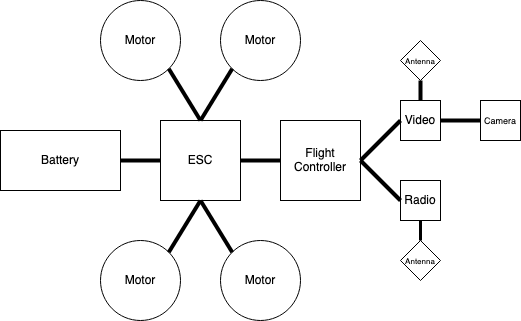

# The Basics

The page will go over the basics of quadcopters. One thing that makes the hobby so interesting are all of the variations and innovation constantly happening. However, this can make it difficult to explain things to a beginner. As such, I will just be touching on the typical setups so a beginner can build a good mental model. There are exceptions to almost everything I outline below - this is just a jumping off point.

## A Typical Quad
In a simple and typical form, a quadcopter consists of 4 propellers attached to 4 motors, controlled and powered by an Electric Speed Controller (ESC), which in turn is powered by a battery. The battery/ESC/motor powertrain is controlled by a Flight Controller (FC), which recieves commands and sends telemetry via a radio receiver listening via an antenna, to a radio in the hands of the pilot. Video is recorded via a camera module to a video transmitter, which uses an antenna to transmit the video to a pair of goggles worn by the pilot. All of the components of the quadrocopter are secured to a frame.

<figure markdown>
{ width=500 }
<figcaption>Block diagram of a quadcopter</figcaption>
</figure>

## Quad Size

In the following sections I will reference quad "sizes" which are not official classes of quads, but are instead general categories to help the reader understand differences that can come from the interplay of different component choices. The two primary dimensions often used to size quads are the propellor size and the dry weight (without battery). These are just my general definitions/categories:

1. Small quads will have propellers that are are less than 2" and dry weight of less than 150 grams.
2. Medium quads will be more in the range of 2" to 4" propellors and up to a dry weight of around 300g. 
3. Large quads will be 5" to 7" propellors and a dry weight over 500g. 

There are of course 5" quads that are less than 250g and heavy 3.5" quads over 350g, but the small/medium/large categories can help when understanding how different components affect other components below.

## The Powertrain

The battery supplies electrical energy to the quad and powers the ESC, which transfers that power to the motors that spin the propellers and create lift.

### Battery

Batteries are typically a Lithium Polymer (LiPo) type and each cell will range from a low voltage of around 2.7-3.0 volts to a fully charged voltage of around 4.2 volts, with a nominal voltage of 3.7 volts.

Quad batteries generally range from 1 cell up to 6 cells. The cells are arranged in a serial configuration, which means the voltage from each cell is added up. Therefore a 2S battery (two cells in serial) will have a nominal voltage of 7.4v (3.7\*2), a 4S battery will have a nominal voltage of 14.8v, and a 6S battery will have a nominal voltage of 22.2v.

Higher voltages will make a difference in how some other components work, as we get to the ESC and motors. For items like the flight controller, radio receiver, and video transmitter, the battery voltage does not matter because the range of input voltages are converted to the voltage needed by those other electronics.

In general, smaller quads will use 1 or 2 cell batteries. Medium quads will use 2 to 4 cell batteries. Large quads will use 4 to 6 cell batteries.

### ESC

An Electronic Speed Controller (ESC) is a device that takes input power from the battery and sends current to each of the four motors, varrying the spead of each motor independently based on control from the Flight Controller (FC) and a reference signal, such as a throttle, from the pilot. 

An ESC is typically rated based on the continuous and burst current it supports, with high ratings needed for larger motors that require more torque to spin larger propellors needed for heavier quads. In general, smaller quads will use a 12-15 amp ESC. Medium quads will use a 30-40A ESC. Large quads will use a 55-65A ESC.

Sometimes an ESC and FC can be packaged/combined into an All-in-One (AIO) board, but even if it is, there will be specs on the ESC part of the package.

The firmware that runs an ESC is different from the firmware that runs the Flight Controller. A very common, open source, ESC firmware is BLHeli.

### Motors

### Propellers

The propellers are a device consisting of a hub with rotating plastic blades that translate the motor's power to thrust. The three main variables for props are the size, the pitch, and the number of blades. The propeller size is the diameter of the circle made by the blades - so the length of each blade is actually a little less than half of the prop size. The pitch is a little unintuitive, but essentially the higher (more aggressive) the pitch, the more air is displaced with each sweep of the blade. The number of blades is just how many blades are mounted on the hub, with the most common being between 2 and 5 blades.

The main thing to keep in mind is the larger the blades, the higher the pitch, and the more blades, the more thrust is generated, but there is a trade-off for each. Larger blades weigh more and are therefore harder to spin up and require more torque to do so, but have more rotational inertia and are more efficient. Higher pitch means more air displaced for each sweep and ultimately is a factor in determining top speed, but again, a higher pitch requires more torque from the motor. Increasing blade count will increase the total surface area of the propeller within the circle, without needing to increase the circle size through an increase in blade length. So why aren't all drones using as many props as possible? because it's more efficient to make the blades longer vs adding more blades.

To keep things simple - most pilots use 3 bladed props because they are a good balance of performance, thrust, torque requirements, etc. For smaller drones you'll see 2 bladed props because the motors are smaller and have less available torque. If you're flying cinematography drones and need a lot of thrust for a heavy payload, but aren't as worried about efficiency or top speed, then 4 or 5 blades are a good option.

## The Flight Controller

### Gyro

### Processor

### Other

## Video and Radio

### Video Transmitter

### Radio Receiver

## Other Accessories

### GPS

### Buzzer

-----

## References

[Lithium Polymer Batteries](https://en.wikipedia.org/wiki/Lithium_polymer_battery)
[Electronic Speed Control](https://en.wikipedia.org/wiki/Electronic_speed_control)
[BLHeli](https://github.com/bitdump/BLHeli)